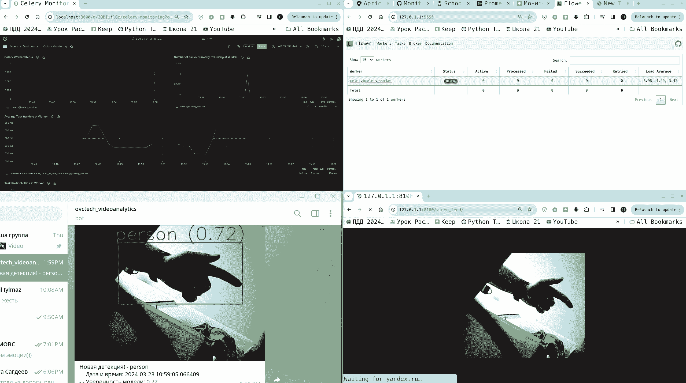

# Checkpoint_7 | Человеческий комментарий для проверки

Пункты 1,2,3 (node exporter, экспортер для статусов очереди задач, django-prometheus) выполнены. Пункт 4 для БД - нет. Для проверки при запуске скрипта из инструкции будут открыты все необходимые url.
Команды для запуска актуальны, всё накатиться и запустится автоматически. Желательно до git pull сделать docker compose down на предыдущем коммите. Возможно, что основная ссылка http://127.0.1.1:8100/video_feed/ с вебкамерой 8100 будет недоступна при открытии, страницу нужно всего лишь обновить.

Для проверки 7 чекпоинта в ссылке с grafana нужно залогиниться (пароль и логин: admin и admin). Далее нужно указать источник - прометеус (ссылка : http://prometheus:9090/), перейти в раздел dashboard, new->import (загрузить из папки проекта: ./grafana/celery-monitoring-grafana-dashboard.json). Далее показываем руку, себя несколько раз в кадр, запуститься красная нить django - celery - flower - prometheus - grafana и вы увидите изменяющиеся графики. Ниже показан скриншот как работает проект.



ВНИМАНИЕ: при отсутствии вебкамеры подготовленное видео не отображается в фронте, но отображается в очереди и приходят уведомления в телеграмм (нужно допиливать кодовую базу, чтобы работал StreamingHttpResponse с mp4, отложили на попозже). Для тестирования с своей вэбкой уведомлений и очередей необходимо оказаться человеку/части тела человека в объективе
ВНИМАНИЕ: для запуска также необходимо поместить файл .env в папку с проектом. При желании можно подписаться на бота. Для этого необходимо написать боту https://t.me/JsonDumpBot , узнать свой "chat": { "**id**":** **123456789** и поместить его в файл .env через запятую. Важно, чтобы в конце OVCTECH_TG_CHAT_IDS была цифра, а не запятая. Токен трогать не нужно. В личку направили Павлу файлик.

По всем возникшим вопросам можно писать в любое время в тг: @ovctech @Alex_alex_68

# Предварительные требования:

**Выполнить следующую команду:**
```bash
cat /etc/os-release
```
*Результат должен быть следующим:*
```plaintext
...
ID_LIKE="ubuntu debian"
или
ID_LIKE="ubuntu"
или
ID_LIKE="debian"
...
```
>В случае другого дистрибутива или ОС работоспособность не гарантирована!


**Выполнить следующую команду:**
```bash
docker -v
```
*Результат должен быть следующим:*
```
Docker version xx.x.x, build xxxxxxx
```
>В случае отсутствия предустановленного средства контейниризации, установите для вашей конфигурации ПК самостоятельно - [Download](https://docs.docker.com/get-docker/).


**Выполнить следующую команду:**
```bash
apt
```
*Результат должен быть следующим:*
```
apt
Usage: apt command [options]
       apt help command [options]

Commands:
...
```
>В случае отсутствия пакетного менеджера apt автоматизированный способ установки и запуска ПО не будет работать корректно!


# Установка и запуск

Скачайте репозиторий и перейдите в корень проекта:
```bash
git clone git@github.com:ovctech/videoanalytics.git -b checkpoint_3 && cd videoanalytics
```

## Автоматизированный метод


Далее необходимо запустить скрипт run.sh, который установит необходимые пакеты для нормальной работы, а также запустить саму программу.
```bash
bash scripts/run.sh
```
> #### При установке будут установлены следующие пакеты в систему:
>
> - make
> - figlet
>
>  *Также* в конец конфигурационного файла оболочки терминала (~/.bashrc | ~/.zshrc | ~/.profile) будет дописан параметр **export OVCTECH_VIDEOANALYTICS_SOFTWARE_INSTALLED=true** для сохранения статуса установки пакетов ПО и дальнейших запусков скрипта run.sh без попытки установки пакетов повторно.

Для пересборки образа и запуска программы (по желанию) вам необходимо также выполнить данный скрипт:
```bash
bash scripts/run.sh
```

## Ручной метод
**Выполнить следующую команду:**
```bash
sudo apt install -y make figlet
bash scripts/docker-compose-setup.sh
sudo make frebuild
sudo make
open http://127.0.1.1:8100/video_feed/?camera_url=do_not_have_webcam__if_have_dont_parametize__just_video_feed_slash
## ИЛИ при наличии вебкамеры
open http://127.0.1.1:8100/video_feed/
```
# Ожидаемый результат

У вас открывается браузер по умолчанию и отображается видео с закатом или видеопоток с вашей вебкамеры в зависимости от открытой *url* ссылки (в случае отсутствия вебкамеры будет отображаться пустая страница, но весь функционал будет работать в нормальном режиме). Также открывается *flower* в браузере за отслеживанием очереди. Также открывается админка *django* с демонстрацией отгрузки статики.
